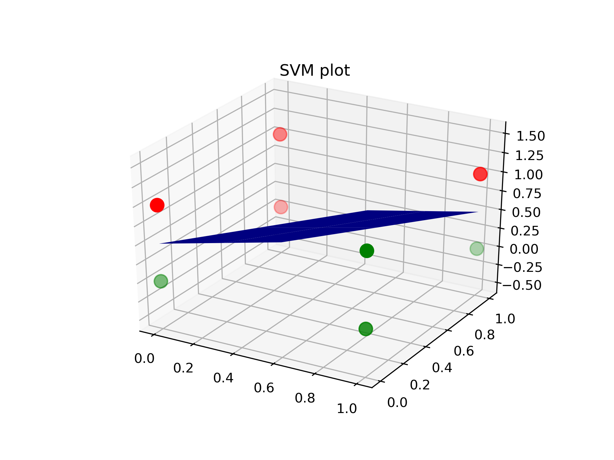
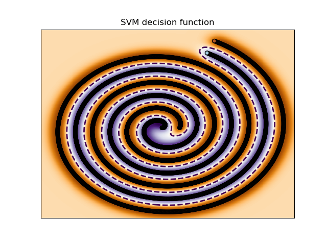

# Machine-Learning

## Questão 1
Considere o problema de classificação de padrões constituído de duas classes 
com os seguintes conjuntos de treinamentos:  
C 1 = {( 0 , 0 , 0 ), ( 1 , 0 , 0 ), ( 1 , 0 , 1 ), ( 1 , 1 , 0 )}  
C 2 = {( 0 , 0 , 1 ), ( 0 , 1 , 1 ), ( 0 , 1 , 0 ), ( 1 , 1 , 1 )}  
Determine o hiperplano de separação dos padrões considerando os seguintes métodos:  
a) Algoritmo do perceptron  
b) Máquina de Vetor de Suporte Linear.  

## Questão 2
Utilize redes neurais perceptrons de múltiplas camadas para aproximar as funções  
abaixo. Para o caso dos itens **b** e **c** e apresente para cada caso a curva da função  
analítica e a curva da função aproximada pela rede neural. Apresente também a curva  
do erro médio de treinamento com relação ao número de épocas e a curva do erro médio  
com o conjunto de validação. Procure definir para cada função a arquitetura da rede  
neural perceptron, isto é, o número de entradas, o número de neurônios em cada camada  
e o número de neurônios camada de saída.  
a) função lógica and  
b) f(x) = cos(2&pi;x)/(1-(4x)²)*sen(&pi;x)/(&pi;x) , 0<x≤4&pi;  
c) f(x,y) = x² + y² + 2xycos(&pi;xy) + x + y -1  

### 2.a Gráficos função logica

  
### 2.b f(x) = cos(2&pi;x)/(1-(4x)²)*sen(&pi;x)/(&pi;x)
%20loss)
%20MAE)
)
### 2.c f(x,y) = x² + y² + 2xycos(&pi;xy) + x + y -1  
%20loss)
%20MAE)
)

## Questão 3

## Questão 4
Considere o problema de reconhecimento de padrões constituído neste caso de uma  
deep learning, no caso uma rede convolutiva capaz de reconhecer os números:  
0, 1,2,3 ..., 9 , mesmo que estes tenham um pequeno giro de até 10 graus.  
Avalie o desempenho de sistema gerando a matriz de confusão. Pesquise  
as base de dados para serem usadas no treinamento  
### gráficos de convergência da rede convolutiva

### Matrix de confusão 

| nan     | 0     | 1             | 2      | 3     | 4     | 5     | 6     | 7     | 8   | 9     | 
|---------|-------|---------------|--------|-------|-------|-------|-------|-------|-------|-------| 
| **0**   | 972   |  0            |  4     |  0    |  1    |  1    |   0   |   0   |   1   |   1   | 
| **1**   |  0    |  1128         |  3     |  1    |  1    |  0    |   1   |   0   |   1   |   0   | 
|  **2**  |  2    | 1             |  1011  |  4    | 2     |  0    |   0   |   8   |  2    |   2   | 
| **3**   |  0    |  0            |  2     |  992  |  0    |  10   |   0   |   2   |   3   |   1   | 
| **4**   |  0    |  0            |  6     |  0    |  961  |  0    |   1   |   0   |   2   |  12   | 
|  **5**  |  1    |  0       |  1     |  0    |  888  |   1   |   0   |   1   |   0   |       | 
| **6**   |  8    |  3            |  1     |  0    |  2    |  10   |  928  |   0   |   6   |   0   | 
|  **7**  |  0    |  1            |  10    |  5    |  5    |  0    |   0   |  991  |   5   |  11   | 
| **8**   |  13   |  0            |  6     |  3    |  1    |  4    |   0   |   1   |  936  |  10   | 
| **9**   |  3    |  4            |  0     |  2    |  13   |  5    |   0   |   1   |  4    |  977  | 

## Questão 5  
Um problema interessante para testar a capacidade de uma rede neural atuar como classificador de padrões  
é o problema das duas espirais intercaladas. A espiral 1 sendo uma classe e a espiral 2 sendo outra classe.  
Gere os exemplos de treinamento usando as seguintes equações:  
para espiral 1:  
x = &theta;/4 cos(&theta;), y = &theta;/4 sen(&theta;)       
para espiral 2:  
x = (&theta;+0.8)/4 cos(&theta;), y = (&theta;+0.8) sen(&theta;)  
fazendo &theta; assumir 100 igualmente espaçados valores entre 0 e 20 radianos. Solucione este
problema considerando:  
a-) Um rede perceptron de múltiplas camadas deep learning  
b-) Uma máquina de vetor de suporte (SVM)  
               
### Gráfico de convergência da  rede deep learning

### Função de decisão formada pela SVM

### Matrix de confusão
| nan | 0   | 1   | 
|-----|-----|-----| 
| 0   | 490 | 10  | 
| 1   | 10  | 490 | 

*OBS:* a deep learning conseguiu 100% de acurácia  
e a no-linear SVN conseguiu 98% de acurácia 

